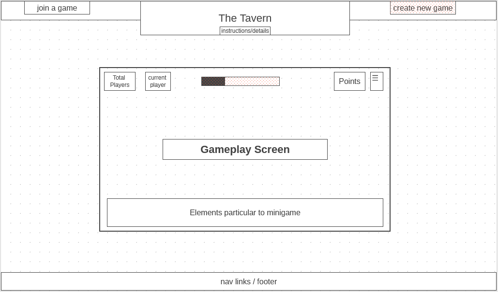

# The Tavern

*You step out of the cold, damp night into the warm glow of the local inn. As you push your way through the patrons to an unoccupied table, your adventuring companions cluster in behind you. It's been a rough day: a quest was abandoned, your rogue tried and conspicuously failed to steal a priceless artifact, and somewhere a distressed damsel remains **decidedly** un-saved. But there's nothing you can do about any of that now. By all the Gods, you need a drink.*

Social distancing has led people to do everything virtually that they can to close the physical distance between each other. The Tavern is another way to bring groups of friends together: it is a combination of smaller games meant to be played in online "rooms" with your friends.

In playing these games, you take on the role of a member of a party of adventurers. You're worn out from constant fighting and in desperate need of letting off some steam, so you challenge your fellow party members to games of chance or skill. It's the little victories that matter.

The Tavern can supplement a night of relaxing, drinking, and bonding in or out of character! Just gather your party and a few flagons of ale.

------

## MVPs

1) Users can start and quit a game
2) Users may select a minigame to begin
    * this will start as being two games, with more to be added
3) Users may accumulate "points" in a minigame, and health decreases with accumulated points
4) Users with no remaining health lose, though may continue to spectate (after a kind cleric uses Lesser Restoration, of course)
5) Users may start either a singleplayer or multiplayer game (singleplayer has reduced game modes)
6) Multiplayer games allow other users to join a server/room and participate in games in real time
7) Singleplayer/"Demo mode" games have AI opponents
8) Users win the game when they are the final remaining player.
9) Individual users/players may "forfeit" a game should they no longer wish to continue. Their health will drop to 0, but they may spectate.
    * Possibly allow to forfeit a single minigame with a penalty?
10) Some in-game circumstances will allow players to give points to another player.

### Bonus features : 
11) Users can choose between "health" and "gold" modes
    * This mode is shared by the entire room, and cannot be changed once a game has started
    * 11b. When beginning gold mode, the player will be asked how much gold they wish to start with.
        * This is largely to facilitate different in-game wealth levels if using during D&D, but will default to 10 gold ( Worry not, bets can be broken down into silver and even copper - though few players would be caught dead gambling with copper pieces! )
12) Users can choose a character class
    * 12b. Each character class gives a special ability that can influence the game
        * For example, the rogue may have an ability to alter dice or switch cards
13) More minigames games
14) Game mode queue: Can't agree on what to play, or just want to do something else next? Add it to the queue and the game will switch to the next mode in the queue when the current game is over.
    * 14b. Allow players to skip or remove things from the queue at majority approval

NOTE : Chat functionality is not a planned feature for The Tavern, as it is meant to supplement another form of communication, such as a zoom or discord video call.

NOTE-THE-SECOND: Scores do not persist, as this game is meant to be active fun with friends, not to have the highest score

-----

## Wireframe

**Create New Game** button becomes the server id when a multiplayer game has been started.

**Health** depletes over time, as you fail challenges or your friends add to your points.

**☰** (menu) - will open a modal allowing players to perform actions like queueing another game mode, forfeiting, changing games, etc

---

## Architecture and Technology

* `JavaScript` - game environment/DOM manipulation
* `Node.js` - Framework
* `Socket.io` - multiplayer (requires node.js)
* `HTML5` / `SCSS` - Styling page
* `HTML5 Canvas` - Game Rendering
* `Webpack` - Bundling

